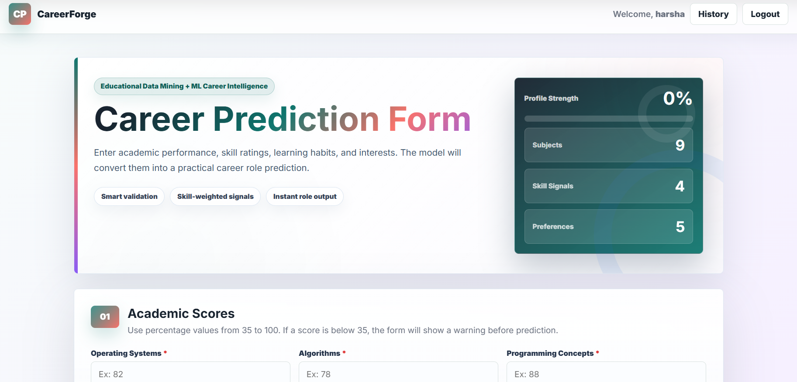

# CareerForge

CareerForge is a Flask-based student career prediction web app with a Capacitor Android wrapper.

## Screenshots

### Home Page


### Create Account


### Career Prediction Form



## Project Structure

- `MY EFFORTS/app.py` - Flask backend and web routes
- `MY EFFORTS/templates/` - HTML templates
- `MY EFFORTS/static/` - CSS, JavaScript, images, and PWA assets
- `MY EFFORTS/career_prediction_model.pkl` - trained prediction model
- `MY EFFORTS/label_mapping.pkl` - prediction label mapping
- `MY EFFORTS/android/` - Capacitor Android project
- `render.yaml` - Render deployment configuration

## Run Locally

```powershell
cd "MY EFFORTS"
.\venv\Scripts\python.exe app.py
```

Then open:

```text
http://127.0.0.1:5000
```

## Deploy To Render

Create a Render Web Service from this GitHub repository.

Use these settings:

```text
Name: careerforge
Root Directory: MY EFFORTS
Environment: Python
Build Command: pip install -r requirements.txt
Start Command: gunicorn app:app --bind 0.0.0.0:$PORT
```

After deployment, open the Render URL and confirm it shows the CareerForge home page.

Live demo:

```text
https://careerforge-akvt.onrender.com
```

## Android APK

The Android app is configured as:

```text
App name: CareerForge
Package id: com.bhoothara.careerforge
Backend URL: https://careerforge-akvt.onrender.com
```

If Render gives a different URL, update `MY EFFORTS/capacitor.config.json`, then run:

```powershell
cd "MY EFFORTS"
npx.cmd cap sync android
cd android
$env:JAVA_HOME='C:\Program Files\Android\Android Studio\jbr'
$env:Path="$env:JAVA_HOME\bin;$env:Path"
.\gradlew.bat assembleDebug
```

The generated APK will be:

```text
MY EFFORTS/android/app/build/outputs/apk/debug/app-debug.apk
```

## Notes

Local databases, virtual environments, Node modules, logs, APK build outputs, and signing keys are intentionally ignored by Git.
